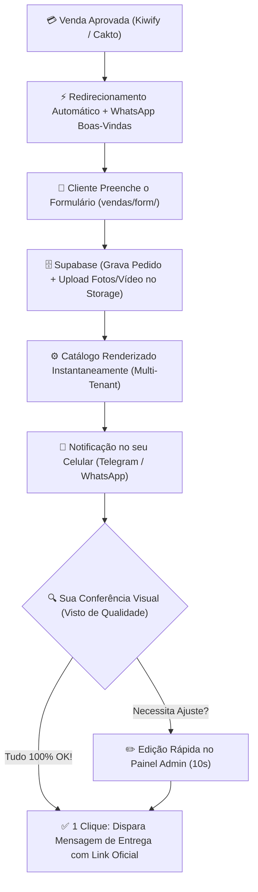

# 🚀 LashMenu — Arquitetura de Automação, Supabase & Operação de Escala

Este documento detalha toda a estratégia de **automação ponta a ponta** do **LashMenu**, desde a aprovação do pagamento no checkout até a entrega oficial do catálogo personalizado no WhatsApp da cliente, com controle total e conferência visual.

---

## 📑 Sumário
1. [Visão Geral do Fluxo Operacional](#1-visão-geral-do-fluxo-operacional)
2. [Do Checkout ao Formulário (Kiwify / Cakto)](#2-do-checkout-ao-formulário-kiwify--cakto)
3. [Estrutura do Banco de Dados (Supabase PostgreSQL)](#3-estrutura-do-banco-de-dados-supabase-postgresql)
4. [Estrutura de Armazenamento (Supabase Storage)](#4-estrutura-de-armazenamento-supabase-storage)
5. [Motor de Geração e Publicação do Catálogo (Multi-Tenant)](#5-motor-de-geração-e-publicação-do-catálogo-multi-tenant)
6. [Painel de Controle Admin & Alerta de Revisão](#6-painel-de-controle-admin--alerta-de-revisão)
7. [Entrega Oficial para a Cliente](#7-entrega-oficial-para-a-cliente)
8. [Roteiro de Implementação Passo a Passo](#8-roteiro-de-implementação-passo-a-passo)

---

## 1. Visão Geral do Fluxo Operacional



---

## 2. Do Checkout ao Formulário (Kiwify / Cakto)

A transição da compra para o formulário de personalização deve ser fluida e com atrito zero:

### A) Redirecionamento Imediato pós-compra (Thank You Page)
Na plataforma de checkout (Kiwify, Cakto, etc.), configure a URL de redirecionamento para:
```
https://lashmenu.com/vendas/form/?email={email}&name={name}&order_id={order_id}&phone={phone}
```
- O formulário captura automaticamente esses parâmetros da URL e já preenche o nome e WhatsApp da cliente.

### B) Mensagem de Boas-Vindas Automática
Caso a cliente feche a página acidentalmente, um webhook dispara um e-mail ou WhatsApp automático:
> *"Olá, [Nome]! Parabéns pela sua aquisição do LashMenu ✨. Para montarmos o seu catálogo exclusivo, preencha este link rápido: https://lashmenu.com/vendas/form/?order_id=[ID]"*

---

## 3. Estrutura do Banco de Dados (Supabase PostgreSQL)

Abaixo estão os scripts SQL prontos para criar as tabelas no Supabase:

```sql
-- 1. Tabela Principal: Pedidos / Catálogos
CREATE TABLE orders (
    id UUID PRIMARY KEY DEFAULT gen_random_uuid(),
    created_at TIMESTAMP WITH TIME ZONE DEFAULT timezone('utc'::text, now()) NOT NULL,
    updated_at TIMESTAMP WITH TIME ZONE DEFAULT timezone('utc'::text, now()) NOT NULL,
    
    -- Dados da Transação
    platform_order_id TEXT, -- ID do pedido na Kiwify / Cakto
    client_email TEXT,
    
    -- Dados do Estúdio & Lash Designer
    client_name TEXT NOT NULL,          -- Como quer ser chamada
    whatsapp TEXT NOT NULL,             -- WhatsApp para agendamentos
    instagram TEXT,                     -- Instagram profissional
    location TEXT,                      -- Local de atendimento
    slug TEXT UNIQUE NOT NULL,          -- Subdomínio exclusivo (ex: marianaalves)
    
    -- Modelo e Paleta Escolhidos
    model_id TEXT NOT NULL DEFAULT 'glamour',  -- 'glamour', 'harmonia', 'classico'
    color_id TEXT NOT NULL DEFAULT 'midnight', -- 'midnight', 'rose', 'champagne'
    
    -- Capa Oficial
    hero_phrase TEXT,                   -- Slogan / Frase de efeito da capa
    cover_media_url TEXT,               -- URL da foto/vídeo de capa (Supabase Storage)
    cover_media_type TEXT DEFAULT 'image', -- 'image' ou 'video'
    
    -- Status Operacional
    status TEXT NOT NULL DEFAULT 'pendente_revisao', 
    -- Valores possíveis: 'preenchendo', 'pendente_revisao', 'aprovado', 'entregue'
    
    published_url TEXT,                 -- URL final (ex: https://marianaalves.lashmenu.com)
    admin_notes TEXT                    -- Anotações internas suas
);

-- 2. Tabela de Procedimentos do Catálogo
CREATE TABLE order_services (
    id UUID PRIMARY KEY DEFAULT gen_random_uuid(),
    order_id UUID REFERENCES orders(id) ON DELETE CASCADE NOT NULL,
    created_at TIMESTAMP WITH TIME ZONE DEFAULT timezone('utc'::text, now()) NOT NULL,
    
    name TEXT NOT NULL,                 -- Nome do procedimento (ex: Volume Brasileiro)
    price TEXT,                         -- Valor (ex: 150,00)
    duration TEXT,                      -- Duração (ex: 1h30)
    maintenance TEXT,                   -- Valor de manutenção (ex: 90,00)
    
    -- Detalhes Avançados
    category TEXT,                      -- Técnica (ex: Extensão em Y)
    description TEXT,                   -- Texto persuasivo de venda
    effect TEXT,                        -- Efeito visual (ex: Preenchimento & Leveza)
    recommendation TEXT,                -- Regra de manutenção (ex: Mínimo 40% dos fios)
    
    -- Mídia do Procedimento
    photo_url TEXT NOT NULL,            -- URL da foto (oficial ou personalizada)
    is_custom_photo BOOLEAN DEFAULT FALSE,
    order_index INT DEFAULT 0           -- Ordem de ordenação (1, 2, 3...)
);

-- 3. Índices para Alto Desempenho
CREATE INDEX idx_orders_slug ON orders(slug);
CREATE INDEX idx_orders_status ON orders(status);
CREATE INDEX idx_order_services_order_id ON order_services(order_id);
```

---

## 4. Estrutura de Armazenamento (Supabase Storage)

Criação dos Buckets de arquivos:

1. **Bucket Público: `catalog-assets`**
   - **Pasta `/covers/`:** Armazena as fotos ou vídeos verticais (9:16) da capa.
   - **Pasta `/services/`:** Armazena as fotos personalizadas enviadas pela cliente para procedimentos específicos.
2. **Políticas de Acesso (RLS):**
   - Leitura: Pública (`SELECT` permitido para todos para carregar o catálogo rápido via CDN).
   - Escrita: Anônima ou autenticada via API Key segura no envio do formulário.

---

## 5. Motor de Geração e Publicação do Catálogo (Multi-Tenant)

A melhor arquitetura é o **Multi-Tenant Dinâmico via Next.js ou Cloudflare/Vercel Middleware**:

### Como funciona na prática:
1. Quando um cliente acessa: `https://marianaalves.lashmenu.com` ou `https://lashmenu.com/c/marianaalves`:
2. O servidor intercepta a requisição, lê o subdomínio `marianaalves` e faz uma consulta rápida no Supabase (em cache):
   ```sql
   SELECT * FROM orders WHERE slug = 'marianaalves';
   ```
3. O servidor carrega o template correspondente (`model_id`: `glamour`, `harmonia` ou `classico` + `color_id`: `midnight` ou `rose`) e injeta:
   - Nome da Lash Designer
   - Link de WhatsApp oficial dela
   - Instagram e localização
   - Foto/Vídeo e Frase de Efeito da Capa
   - Lista completa de procedimentos, fotos e valores

> **Vantagens dessa Arquitetura:**
> - **Tempo de Geração: 0 segundos.** O link já funciona imediatamente após a cliente preencher o formulário.
> - **Edição Instantânea:** Se a cliente pedir para alterar um preço ou foto depois, você altera no banco e a página dela atualiza na mesma hora, sem precisar de re-deploy!

---

## 6. Painel de Controle Admin & Alerta de Revisão

Para que você mantenha o padrão de qualidade VIP com esforço mínimo:

### A) Alerta no seu Telegram / WhatsApp (Bot Automático)
Assim que o formulário é enviado, você recebe:

```text
🔔 NOVO CATÁLOGO AGUARDANDO REVISÃO!

👤 Cliente: Mariana Alves
📱 WhatsApp: (11) 98765-4321
🎨 Modelo: Glamour Midnight
🌐 Subdomínio: marianaalves.lashmenu.com

🔗 Link de Prévia: https://marianaalves.lashmenu.com

[ 👁️ Abrir Prévia ]  [ ✏️ Editar no Painel ]  [ 🚀 APROVAR E ENTREGAR ]
```

### B) Painel Administrativo Web (`/admin`)
- Listagem de todos os pedidos com filtros (*Pendentes*, *Aprovados*, *Entregues*).
- Visualizador com edição inline (corrigir erros ortográficos, reordenar procedimentos ou trocar fotos com 1 clique).
- Botão de **"Aprovar e Disparar Entrega"**.

---

## 7. Entrega Oficial para a Cliente

Ao clicar no botão de entrega, o sistema pode abrir direto uma mensagem pré-formatada no seu WhatsApp Web (ou disparar via API oficial):

```text
Olá, Mariana! ✨👑

Seu catálogo digital oficial LashMenu está pronto, calibrado e no ar! 🚀

🔗 Seu Link Exclusivo:
👉 https://marianaalves.lashmenu.com

📌 O que fazer agora:
1. Abra o link no seu celular e confira seu catálogo completo.
2. Coloque este link na bio do seu Instagram e no seu perfil do WhatsApp Business.
3. Comece a enviar para suas clientes no momento do agendamento!

Qualquer dúvida ou ajuste que precisar, nossa equipe de suporte está à sua inteira disposição. Parabéns pelo seu novo posicionamento de luxo! 💖✨
```

---

## 8. Roteiro de Implementação Passo a Passo

1. **Fase 1: Configuração do Supabase**
   - Criar o projeto no Supabase e rodar o script SQL das tabelas `orders` e `order_services`.
   - Configurar o Bucket `catalog-assets` com leitura pública.
2. **Fase 2: Conexão do Formulário (`vendas/form/`)**
   - Integrar o JavaScript do formulário para salvar o pedido no Supabase e enviar as fotos via upload direto.
3. **Fase 3: Roteador de Catálogos (Multi-Tenant Engine)**
   - Configurar o roteamento dinâmico que carrega o modelo oficial (`glamour`, `harmonia`, `classico`) preenchido com os dados do banco.
4. **Fase 4: Painel Admin & Notificações de Revisão**
   - Criar a interface de administração para controle de qualidade e disparo de entrega.

---
*Documento gerado para a operação oficial LashMenu.*
