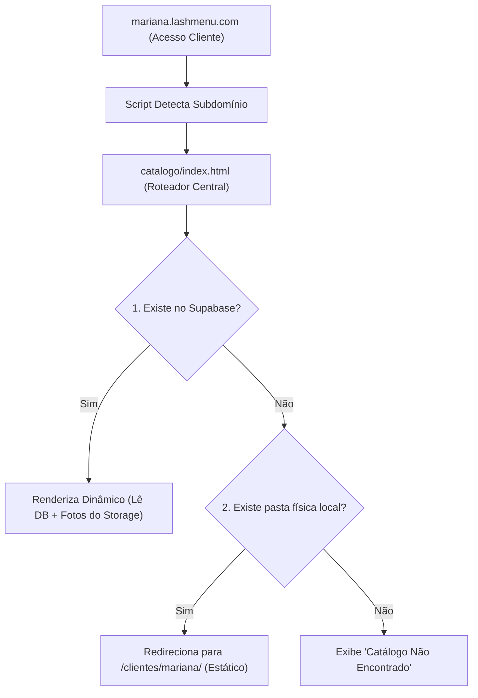

# 👑 LashMenu — Documentação de Unificação e Roteamento

Este documento detalha o processo de consolidação dos projetos **`lashmenu-vendas`** e **`lashmenu-clientes`** em um único repositório unificado. O objetivo desta mudança é simplificar a operação, facilitar os deploys na Vercel e viabilizar o uso do domínio único **`lashmenu.com`** para todo o ecossistema.

---

## 📌 1. Visão Geral da Nova Arquitetura

Com a unificação, o projeto `lashmenu-vendas` passa a concentrar tanto a plataforma operacional de vendas/onboarding quanto a hospedagem de catálogos (dinâmicos e estáticos).



---

## 📁 2. Nova Estrutura de Pastas do Repositório

```text
├── admin/                  # Painel Administrativo de Revisão e Entrega VIP
├── catalogo/               # Roteador Multi-Tenant & Fallback Inteligente
│   ├── index.html          # Ponto de entrada do roteador
│   └── js/
│       └── catalog-injector.js
├── clientes/               # [NOVO] Catálogos ativos de clientes estáticos/manuais
│   ├── mariana-alves/
│   ├── amanda-carvalho/
│   └── ...
├── templates/              # [NOVO] Templates estáticos originais limpos (manual)
├── vendas/                 # Módulo de LP e Onboarding
│   ├── form/               # Formulário Comercial de Coleta
│   ├── lpa/                # Landing Page Editorial (Champagne)
│   └── lpb/                # Landing Page Principal (Rosé)
├── index.html              # Hub Central de Operações
└── vercel.json             # Regras de Roteamento unificadas da Vercel
```

---

## ⚙️ 3. Como Funcionam as Regras de Roteamento

### A) Roteamento por URL no Vercel (`vercel.json`)
No arquivo [vercel.json](file:///Users/donisilva/Downloads/lashmenu-vendas/vercel.json), incluímos uma regra curinga ao final do arquivo:
```json
{ "source": "/:slug", "destination": "/clientes/:slug/index.html" }
```
* **O que faz**: Se alguém digitar `lashmenu.com/mariana-alves`, o servidor Vercel entende que não existe uma pasta física na raiz com esse nome e reescreve a requisição internamente para `/clientes/mariana-alves/index.html`. Isso garante compatibilidade total com os links antigos.

### B) Detecção de Subdomínio nas Páginas Iniciais
Nos arquivos [index.html (raiz)](file:///Users/donisilva/Downloads/lashmenu-vendas/index.html), [vendas/lpb/index.html](file:///Users/donisilva/Downloads/lashmenu-vendas/vendas/lpb/index.html) e [vendas/lpa/index.html](file:///Users/donisilva/Downloads/lashmenu-vendas/vendas/lpa/index.html), adicionamos um script leve de detecção de subdomínio:
```html
<script>
  (function() {
    const hostname = window.location.hostname;
    // Ignora preview da Vercel e localhost
    if (hostname.endsWith('.vercel.app') || hostname === 'localhost' || hostname === '127.0.0.1') return;
    
    const hostParts = hostname.split('.');
    // Verifica se é um subdomínio de cliente (ex: mariana.lashmenu.com)
    if (hostParts.length >= 3 && hostParts[0] !== 'www' && hostParts[0] !== 'lashmenu-vendas') {
      window.location.replace('/catalogo/');
    }
  })();
</script>
```
* **O que faz**: Caso uma cliente ou visitante digite `mariana.lashmenu.com`, ela seria direcionada para a página de vendas raiz por padrão na Vercel. O script intercepta a navegação no primeiro milissegundo e a direciona para `/catalogo/` para carregar o catálogo.

### C) Fallback Inteligente no Roteador (`/catalogo/index.html`)
O arquivo [catalogo/index.html](file:///Users/donisilva/Downloads/lashmenu-vendas/catalogo/index.html) foi modificado para suportar o fluxo híbrido (Dinâmico + Estático):
1. Ele extrai o *slug* (ex: `mariana`) a partir do subdomínio `mariana.lashmenu.com` ou da query parameter `?slug=mariana`.
2. **Busca Dinâmica**: Consulta a tabela `orders` no Supabase. Se o cadastro existir, redireciona o navegador para o template correspondente carregando as informações via `catalog-injector.js`.
3. **Busca Estática (Fallback)**: Caso a consulta no Supabase retorne vazia, o JavaScript faz um `fetch` local rápido para checar a existência do arquivo manual `/clientes/mariana/index.html`.
   * Se o arquivo existir (retorno 200 OK), redireciona o navegador para a pasta correspondente.
   * Se não existir, esconde o carregador e exibe a tela de erro "Catálogo Não Encontrado".

---

## 📝 4. Como Adicionar Novas Clientes Daqui para Frente

### Opção A: Automatizado (Supabase) - Recomendado
1. A cliente efetua o preenchimento no formulário oficial: `lashmenu.com/form`.
2. O sistema grava os dados e fotos no Supabase.
3. Você acessa o painel admin em `lashmenu.com/admin` (senha PIN `1234`), revisa o catálogo e clica em **"Aprovar & Entregar"**.
4. O link gerado será: `https://[slug-da-cliente].lashmenu.com` (totalmente dinâmico, sem alterar o código do repositório).

### Opção B: Manual (Código Estático) - Caso VIP Específico
1. Copie um dos modelos da pasta `/templates/` para dentro da pasta `/clientes/` e renomeie-a para o slug da cliente (ex: `clientes/camila-silva/`).
2. Substitua as imagens na pasta `clientes/camila-silva/assets/img/`.
3. Edite as informações, serviços e links de WhatsApp diretamente no `index.html` daquela pasta.
4. Faça o commit e dê `git push`.
5. O link gerado será: `https://lashmenu.com/camila-silva` ou `https://camila-silva.lashmenu.com`.
